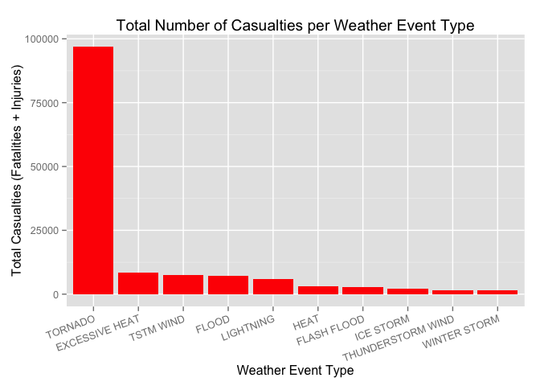

# U.S. Weather Activities versus the Public Health
Jim Stephenson  
August 24, 2014  

## U.S. Weather Activities versus the Public Health
### Synopsis


### Data Processing

Data for this project comes from NOAA's storm database.  The [data file](https://d396qusza40orc.cloudfront.net/repdata%2Fdata%2FStormData.csv.bz2) is a fairly large (47MB) bzipped file that decompresses to a large (562MB) CSV file.  Within the data file are records of weather events spanning 1950 to 2011.


```r
## download and extract the data 
if (!file.exists("./data")) {
  dir.create("./data")
  fileURL <- "https://d396qusza40orc.cloudfront.net/repdata%2Fdata%2FStormData.csv.bz2"
  download.file(fileURL, destfile = "./data/dataset.bz2", method = "curl", mode = "wb")
}
# note: this next line will take a *very* long time to execute (5 or more minutes)
# ... go make a cup of coffee ...
storm <- read.csv(bzfile("./data/dataset.bz2", "r"))
```
After reading in the data, we can see that there are over 900K records, with 37 variables.  Fortunately, the columns we care about -- Event Type (EVTYPE), Fatalities (FATALITIES), Injuries (INJURIES), Property Damage (PROPDMG), Property Damage Exponant (PROPDMGEXP), Crop Damage (CROPDMG), and Crop Damage Exponant (CROPDMGEXP) -- do not contain NA values, so we don't have to manage them:


```r
dim(storm)
```

```
## [1] 902297     37
```

```r
na.test <-c(anyNA(storm$EVTYPE),anyNA(storm$FATALITIES), anyNA(storm$INJURIES),
            anyNA(storm$PROPDMG),anyNA(storm$PROPDMGEXP),
            anyNA(storm$CROPDMG), anyNA(storm$CROPDMGEXP))
na.test
```

```
## [1] FALSE FALSE FALSE FALSE FALSE FALSE FALSE
```

However, there are odd values in the PROPDMGEXP and CROPDMGEXP that will have to be taken care of:


```r
levels(storm$PROPDMGEXP)
```

```
##  [1] ""  "-" "?" "+" "0" "1" "2" "3" "4" "5" "6" "7" "8" "B" "h" "H" "K"
## [18] "m" "M"
```

```r
levels(storm$CROPDMGEXP)
```

```
## [1] ""  "?" "0" "2" "B" "k" "K" "m" "M"
```
According to the National Weather Service [Storm Data Documentation](https://d396qusza40orc.cloudfront.net/repdata%2Fpeer2_doc%2Fpd01016005curr.pdf) (section 2.7, page 12), these values should be letter codes corresponding to the magnitude of the cost, i.e.: K for thousands, M for millions, B for billions.  To see how bad the problem is, we run the following code:


```r
nrow(storm[!(storm$PROPDMGEXP %in% c("K", "M", "B", "k", "m", "b", "")),])
```

```
## [1] 321
```

```r
nrow(storm[!(storm$CROPDMGEXP %in% c("K", "M", "B", "k", "m", "b", "")),])
```

```
## [1] 27
```
Since ony 321 records have bad data in PROPDMGEXP, and only 27 have bad data in CROPDMGEXP, we can safely remove these records, then use the the letter codes to modify the PROPDMG and CROPDMG columns to actual values, then find the total value of all damage:


```r
# get rid of bad EXP values
storm <- storm[(storm$PROPDMGEXP %in% c("K", "M", "B", "k", "m", "b", "")),]
storm <- storm[(storm$CROPDMGEXP %in% c("K", "M", "B", "k", "m", "b", "")),]
nrow(storm)
```

```
## [1] 901949
```

```r
# multiply the PROPDMG and CROPDMG fields by their EXP values
storm$PROPMULT <- 1
storm$PROPMULT[storm$PROPDMGEXP %in% c("K", "k")] <- 1000
storm$PROPMULT[storm$PROPDMGEXP %in% c("M", "m")] <- 1000000
storm$PROPMULT[storm$PROPDMGEXP %in% c("B", "b")] <- 1000000000
storm$PROPDMG <- storm$PROPDMG * storm$PROPMULT
storm$CROPMULT <- 1
storm$CROPMULT[storm$CROPDMGEXP %in% c("K", "k")] <- 1000
storm$CROPMULT[storm$CROPDMGEXP %in% c("M", "m")] <- 1000000
storm$CROPMULT[storm$CROPDMGEXP %in% c("B", "b")] <- 1000000000
storm$CROPDMG <- storm$CROPDMG * storm$CROPMULT
storm$TOTALDMG <- storm$PROPDMG + storm$CROPDMG
```
### Results
#### Fatalities and Injuries
Now that the data has been tidied, the first question to ask is what weather events are most harmful to public health.  Using the dplyr package, we can easily aggregate fatalities and injuries versus event:


```r
# load required libraries for analysis
stopifnot(require(dplyr))
stopifnot(require(ggplot2))

# find weather events with fatalities
f <- summarise(group_by(storm, EVTYPE), sum(FATALITIES))
names(f)[2] <- "Fatalities"      # clean up the name
f <- f[f$Fatalities != 0, ]      # keep only events with nonzero fatalities

#find weather events with injuries
i <- summarise(group_by(storm, EVTYPE), sum(INJURIES))
names(i)[2] <- "Injuries"        # clean up the name
i <- i[i$Injuries != 0, ]        # keep only events with nonzero injuries
```

The number one cause of death by weather is tornado, with 5630 fatalities during the years recorded.  This is almost three times the number of fatalities from the next most common event, excessive heat:

```r
f <- f[order(-f$Fatalities), ]   # sort in descending order by fatalities
head(f, 10)
```

```
## Source: local data frame [10 x 2]
## 
##             EVTYPE Fatalities
## 830        TORNADO       5630
## 129 EXCESSIVE HEAT       1903
## 152    FLASH FLOOD        978
## 272           HEAT        937
## 460      LIGHTNING        816
## 852      TSTM WIND        504
## 168          FLOOD        470
## 581    RIP CURRENT        368
## 356      HIGH WIND        246
## 19       AVALANCHE        224
```

The number one cause of injuries is also tornados, with 91,321 injuries during the years recorded.  This is _an order of magnitude_ greater than the next most common event, marine thunderstorm wind (TSTM WIND):

```r
i <- i[order(-i$Injuries), ]     # sort in descending order by injuries
head(i, 10)
```

```
## Source: local data frame [10 x 2]
## 
##                EVTYPE Injuries
## 830           TORNADO    91321
## 852         TSTM WIND     6957
## 168             FLOOD     6789
## 129    EXCESSIVE HEAT     6525
## 460         LIGHTNING     5230
## 272              HEAT     2100
## 423         ICE STORM     1975
## 152       FLASH FLOOD     1777
## 756 THUNDERSTORM WIND     1488
## 241              HAIL     1358
```

To simplify, lets merge the top ten from each category (fatalities, injuries), replace NAs with 0, and then chart the combined totals:


```r
# merge the two together
harm <- merge(f, i, by.x = "EVTYPE", by.y = "EVTYPE", all=TRUE)
harm[is.na(harm$Fatalities),][, 2] <- 0
harm[is.na(harm$Injuries),][, 3] <- 0
harm$Total <- harm$Fatalities + harm$Injuries

# display the top 
harm <- harm[order(-harm$Total, harm$EVTYPE), ]
head(harm, 10)
```

```
##                EVTYPE Fatalities Injuries Total
## 183           TORNADO       5630    91321 96951
## 32     EXCESSIVE HEAT       1903     6525  8428
## 190         TSTM WIND        504     6957  7461
## 47              FLOOD        470     6789  7259
## 122         LIGHTNING        816     5230  6046
## 69               HEAT        937     2100  3037
## 42        FLASH FLOOD        978     1777  2755
## 116         ICE STORM         89     1975  2064
## 172 THUNDERSTORM WIND        133     1488  1621
## 213      WINTER STORM        206     1321  1527
```

Tornados still dominate the _harm_ category.  To make it painfully obvious, examing this bar chart showing how each weather even in the top ten of the merged dataset compare:

```r
# display harm as a barchart
h <- head(harm, 10)
ggplot(data=head(harm, 10), aes(x=reorder(EVTYPE, -Total), y=Total)) + 
  geom_bar(stat="identity", fill="red") +
  theme(axis.text.x = element_text(angle=20, hjust=1)) +
  xlab("Weather Event Type") +
  ylab("Total Casualties (Fatalities + Injuries)") +
  ggtitle("Total Number of Casualties per Weather Event Type")
```

 

#### Property and Crop Damage
The other main issue we care about is property and crop damage.  Once again we'll start by aggregating data for each one separately:

```r
# find weather events that caused property damage
p <- summarise(group_by(storm, EVTYPE), sum(PROPDMG))
names(p)[2] <- "PDamage"      # clean up the name
p <- p[p$PDamage != 0, ]      # keep only events with nonzero damage events

#find weather events that caused crop damage
c <- summarise(group_by(storm, EVTYPE), sum(CROPDMG))
names(c)[2] <- "CDamage"          # clean up the name
c <- c[c$CDamage != 0, ]          # keep only events with nonzero damage events
```

The number one cause of property damage is flood (US$145 billion); the next three -- hurricane/typhoon (US$69 billion), tornado (USD$60 billion), and storm surge (USD$43 billion) -- are each between a half and a third the cost of flood damage:

```r
p <- p[order(-p$PDamage), ]   # sort in descending order by fatalities
p$PropertyDamage <- as.character(p$PDamage)
head(p[, c(1, 3)], 10)
```

```
## Source: local data frame [10 x 2]
## 
##                EVTYPE PropertyDamage
## 168             FLOOD   144657709807
## 407 HURRICANE/TYPHOON    69305840000
## 830           TORNADO    56936985483
## 666       STORM SURGE    43323536000
## 152       FLASH FLOOD    16140811717
## 241              HAIL    15732261777
## 398         HURRICANE    11868319010
## 844    TROPICAL STORM     7703890550
## 968      WINTER STORM     6688497250
## 356         HIGH WIND     5270046260
```

The number one cause of crop damage is drought (US$14 billion); the next three -- flood (US$6 billion), river flood (US$5 billion), and ice storm (US$5 billion) -- are also between a half and a third the cost of flood damage:

```r
c <- c[order(-c$CDamage), ]   # sort in descending order by fatalities
c$CropDamage <- as.character(c$CDamage)
head(c[, c(1, 3)], 10)
```

```
## Source: local data frame [10 x 2]
## 
##                EVTYPE  CropDamage
## 94            DROUGHT 13972566000
## 168             FLOOD  5661968450
## 586       RIVER FLOOD  5029459000
## 423         ICE STORM  5022110000
## 241              HAIL  3000954453
## 398         HURRICANE  2741910000
## 407 HURRICANE/TYPHOON  2607872800
## 152       FLASH FLOOD  1420727100
## 139      EXTREME COLD  1292973000
## 209      FROST/FREEZE  1094086000
```
