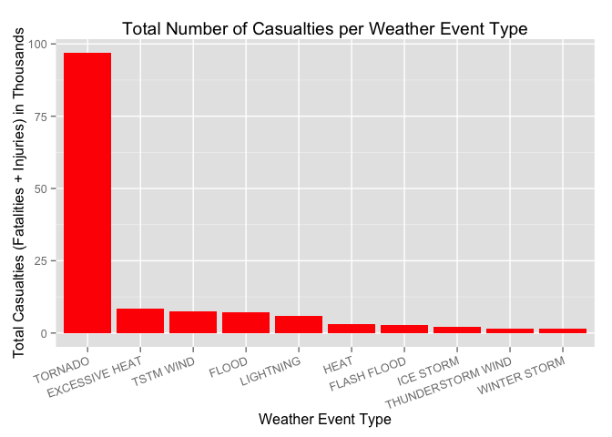

# U.S. Weather Activities versus the Public Health
Jim Stephenson  
August 24, 2014  

### Synopsis
In this report we aim to identify which types of weather events are the leading causes of human casualties (fatalities and injuries) and property damage (including crop damage).  Data was obtained from the National Oceanic and Atmospheric Administration's (NOAA) storm database.  This database contains data for weather events from 1950 to 2011.  From the data we determined that tornados are the leading cause of fatality and injury; flood causes the most property damage, while drought causes the most crop damage. 

### Data Processing

Data for this project comes from NOAA's storm database.  The [data file](https://d396qusza40orc.cloudfront.net/repdata%2Fdata%2FStormData.csv.bz2) is a fairly large (47MB) bzipped file that decompresses to a large (562MB) CSV file.  Within the data file are records of weather events spanning 1950 to 2011.


```r
## download and extract the data 
if (!file.exists("./data")) {
  dir.create("./data")
  fileURL <- "https://d396qusza40orc.cloudfront.net/repdata%2Fdata%2FStormData.csv.bz2"
  download.file(fileURL, destfile = "./data/dataset.bz2", method = "curl", mode = "wb")
}
# note: this next line will take a *very* long time to execute (5 or more minutes)
# ... go make a cup of coffee ...
storm <- read.csv(bzfile("./data/dataset.bz2", "r"))
```

After reading in the data, we can see that there are over 900K records, with 37 variables.  Fortunately, the columns we care about -- Event Type (EVTYPE), Fatalities (FATALITIES), Injuries (INJURIES), Property Damage (PROPDMG), Property Damage Exponant (PROPDMGEXP), Crop Damage (CROPDMG), and Crop Damage Exponant (CROPDMGEXP) -- do not contain NA values, so we don't have to manage them:


```r
dim(storm)
```

```
## [1] 902297     37
```

```r
na.test <-c(anyNA(storm$EVTYPE),anyNA(storm$FATALITIES), anyNA(storm$INJURIES),
            anyNA(storm$PROPDMG),anyNA(storm$PROPDMGEXP),
            anyNA(storm$CROPDMG), anyNA(storm$CROPDMGEXP))
na.test
```

```
## [1] FALSE FALSE FALSE FALSE FALSE FALSE FALSE
```

However, there are odd values in the PROPDMGEXP and CROPDMGEXP that will have to be taken care of:


```r
levels(storm$PROPDMGEXP)
```

```
##  [1] ""  "-" "?" "+" "0" "1" "2" "3" "4" "5" "6" "7" "8" "B" "h" "H" "K"
## [18] "m" "M"
```

```r
levels(storm$CROPDMGEXP)
```

```
## [1] ""  "?" "0" "2" "B" "k" "K" "m" "M"
```
According to the National Weather Service [Storm Data Documentation](https://d396qusza40orc.cloudfront.net/repdata%2Fpeer2_doc%2Fpd01016005curr.pdf) (section 2.7, page 12), these values should be letter codes corresponding to the magnitude of the cost, i.e.: K for thousands, M for millions, B for billions.  To see how bad the problem is, we run the following code:


```r
nrow(storm[!(storm$PROPDMGEXP %in% c("K", "M", "B", "k", "m", "b", "")),])
```

```
## [1] 321
```

```r
nrow(storm[!(storm$CROPDMGEXP %in% c("K", "M", "B", "k", "m", "b", "")),])
```

```
## [1] 27
```
Since ony 321 records have bad data in PROPDMGEXP, and only 27 have bad data in CROPDMGEXP, we can safely remove these records, then use the the letter codes to modify the PROPDMG and CROPDMG columns to actual values, then find the total value of all damage:


```r
# get rid of bad EXP values
storm <- storm[(storm$PROPDMGEXP %in% c("K", "M", "B", "k", "m", "b", "")),]
storm <- storm[(storm$CROPDMGEXP %in% c("K", "M", "B", "k", "m", "b", "")),]
nrow(storm)
```

```
## [1] 901949
```

```r
# multiply the PROPDMG and CROPDMG fields by their EXP values
storm$PROPMULT <- 1
storm$PROPMULT[storm$PROPDMGEXP %in% c("K", "k")] <- 1000
storm$PROPMULT[storm$PROPDMGEXP %in% c("M", "m")] <- 1000000
storm$PROPMULT[storm$PROPDMGEXP %in% c("B", "b")] <- 1000000000
storm$PROPDMG <- storm$PROPDMG * storm$PROPMULT
storm$CROPMULT <- 1
storm$CROPMULT[storm$CROPDMGEXP %in% c("K", "k")] <- 1000
storm$CROPMULT[storm$CROPDMGEXP %in% c("M", "m")] <- 1000000
storm$CROPMULT[storm$CROPDMGEXP %in% c("B", "b")] <- 1000000000
storm$CROPDMG <- storm$CROPDMG * storm$CROPMULT
storm$TOTALDMG <- storm$PROPDMG + storm$CROPDMG
```
### Results
#### Fatalities and Injuries
Now that the data has been tidied, the first question to ask is what weather events are most harmful to public health.  Using the dplyr package, we can easily aggregate fatalities and injuries versus event:


```r
# load required libraries for analysis
stopifnot(require(dplyr))
stopifnot(require(ggplot2))

# find weather events with fatalities
f <- summarise(group_by(storm, EVTYPE), sum(FATALITIES))
names(f)[2] <- "Fatalities"      # clean up the name
f <- f[f$Fatalities != 0, ]      # keep only events with nonzero fatalities

#find weather events with injuries
i <- summarise(group_by(storm, EVTYPE), sum(INJURIES))
names(i)[2] <- "Injuries"        # clean up the name
i <- i[i$Injuries != 0, ]        # keep only events with nonzero injuries
```

The number one cause of death by weather are _tornados_, with 5630 fatalities during the years recorded.  This is almost three times the number of fatalities from the next most common event, _excessive heat_:

```r
f <- f[order(-f$Fatalities), ]   # sort in descending order by fatalities
head(f, 10)
```

```
## Source: local data frame [10 x 2]
## 
##             EVTYPE Fatalities
## 830        TORNADO       5630
## 129 EXCESSIVE HEAT       1903
## 152    FLASH FLOOD        978
## 272           HEAT        937
## 460      LIGHTNING        816
## 852      TSTM WIND        504
## 168          FLOOD        470
## 581    RIP CURRENT        368
## 356      HIGH WIND        246
## 19       AVALANCHE        224
```

The number one cause of injuries is also _tornados_, with 91,321 injuries during the years recorded.  This is an _order of magnitude_ greater than the next most common event, _marine thunderstorm wind_ (TSTM WIND):

```r
i <- i[order(-i$Injuries), ]     # sort in descending order by injuries
head(i, 10)
```

```
## Source: local data frame [10 x 2]
## 
##                EVTYPE Injuries
## 830           TORNADO    91321
## 852         TSTM WIND     6957
## 168             FLOOD     6789
## 129    EXCESSIVE HEAT     6525
## 460         LIGHTNING     5230
## 272              HEAT     2100
## 423         ICE STORM     1975
## 152       FLASH FLOOD     1777
## 756 THUNDERSTORM WIND     1488
## 241              HAIL     1358
```

To simplify, lets merge each category (fatalities, injuries) into a unified _harm_ category, replace NAs with 0, and then view the combined totals:


```r
# merge the two together
harm <- merge(f, i, by.x = "EVTYPE", by.y = "EVTYPE", all=TRUE)
harm[is.na(harm$Fatalities),][, 2] <- 0
harm[is.na(harm$Injuries),][, 3] <- 0
harm$Total <- harm$Fatalities + harm$Injuries

# display the top 
harm <- harm[order(-harm$Total, harm$EVTYPE), ]
head(harm, 10)
```

```
##                EVTYPE Fatalities Injuries Total
## 183           TORNADO       5630    91321 96951
## 32     EXCESSIVE HEAT       1903     6525  8428
## 190         TSTM WIND        504     6957  7461
## 47              FLOOD        470     6789  7259
## 122         LIGHTNING        816     5230  6046
## 69               HEAT        937     2100  3037
## 42        FLASH FLOOD        978     1777  2755
## 116         ICE STORM         89     1975  2064
## 172 THUNDERSTORM WIND        133     1488  1621
## 213      WINTER STORM        206     1321  1527
```

Tornados still dominate the _harm_ category.  To make it painfully obvious, examing this bar chart showing how each weather even in the top ten of the merged dataset compare:

```r
# display harm as a barchart
harm$Total <- harm$Total/1000  # scale it down to make it easier to understand in the chart
ggplot(data=head(harm, 10), aes(x=reorder(EVTYPE, -Total), y=Total)) + 
  geom_bar(stat="identity", fill="red") +
  theme(axis.text.x = element_text(angle=20, hjust=1)) +
  xlab("Weather Event Type") +
  ylab("Total Casualties (Fatalities + Injuries) in Thousands") +
  ggtitle("Total Number of Casualties per Weather Event Type")
```

 

#### Property and Crop Damage
The other main issue we care about is property and crop damage.  Once again we'll start by aggregating data for each one separately:

```r
# find weather events that caused property damage
p <- summarise(group_by(storm, EVTYPE), sum(PROPDMG))
names(p)[2] <- "PropertyDamageBillions"     # clean up the name
p <- p[p$PropertyDamageBillions != 0, ]     # keep only events with nonzero damage events
p$PropertyDamageBillions <- p$PropertyDamageBillions/1000000000  # scale down to billions for readability

#find weather events that caused crop damage
c <- summarise(group_by(storm, EVTYPE), sum(CROPDMG))
names(c)[2] <- "CropDamageBillions"         # clean up the name
c <- c[c$CropDamageBillions != 0, ]         # keep only events with nonzero damage events
c$CropDamageBillions <- c$CropDamageBillions/1000000000  # scale down to billions for readability
```

The number one cause of property damage is _flooding_ (US$145 billion); the next three -- _hurricane/typhoon_ (US$69 billion), _tornado_ (USD$60 billion), and _storm surge_ (USD$43 billion) -- are each between a half and a third the cost of _flood_ damage:

```r
p <- p[order(-p$PropertyDamageBillions), ]   # sort in descending order by fatalities
head(p, 10)
```

```
## Source: local data frame [10 x 2]
## 
##                EVTYPE PropertyDamageBillions
## 168             FLOOD                144.658
## 407 HURRICANE/TYPHOON                 69.306
## 830           TORNADO                 56.937
## 666       STORM SURGE                 43.324
## 152       FLASH FLOOD                 16.141
## 241              HAIL                 15.732
## 398         HURRICANE                 11.868
## 844    TROPICAL STORM                  7.704
## 968      WINTER STORM                  6.688
## 356         HIGH WIND                  5.270
```

The number one cause of crop damage is _drought_ (US$14 billion); the next three -- _flood_ (US$6 billion), _river flood_ (US$5 billion), and _ice storm_ (US$5 billion) -- are also between a half and a third the cost of _flood_ damage:

```r
c <- c[order(-c$CropDamageBillions), ]   # sort in descending order by fatalities
head(c, 10)
```

```
## Source: local data frame [10 x 2]
## 
##                EVTYPE CropDamageBillions
## 94            DROUGHT             13.973
## 168             FLOOD              5.662
## 586       RIVER FLOOD              5.029
## 423         ICE STORM              5.022
## 241              HAIL              3.001
## 398         HURRICANE              2.742
## 407 HURRICANE/TYPHOON              2.608
## 152       FLASH FLOOD              1.421
## 139      EXTREME COLD              1.293
## 209      FROST/FREEZE              1.094
```
Combining both categories to get the total cost of weather related events, we can see that _flooding_ costs more than all other events, and that since crop damage is smaller by an order of magnitude than property damage, the order (and relative size) of the cost per event is pretty much the same as for property damage itself:

```r
# merge the two together
cost <- merge(p, c, by.x = "EVTYPE", by.y = "EVTYPE", all=TRUE)
cost[is.na(cost$PropertyDamageBillions),][, 2] <- 0
cost[is.na(cost$CropDamageBillions),][, 3] <- 0
cost$Total <- (cost$PropertyDamageBillions + cost$CropDamageBillions)
#cost$TotalBillions <- format(cost$Total, digits=4, justify="right", scientific=FALSE)

# display the top 
cost <- cost[order(-cost$Total, cost$EVTYPE), ]
head(cost, 10)
```

```
##                EVTYPE PropertyDamageBillions CropDamageBillions   Total
## 70              FLOOD                144.658           5.661968 150.320
## 192 HURRICANE/TYPHOON                 69.306           2.607873  71.914
## 348           TORNADO                 56.937           0.364950  57.302
## 294       STORM SURGE                 43.324           0.000005  43.324
## 113              HAIL                 15.732           3.000954  18.733
## 58        FLASH FLOOD                 16.141           1.420727  17.562
## 38            DROUGHT                  1.046          13.972566  15.019
## 184         HURRICANE                 11.868           2.741910  14.610
## 257       RIVER FLOOD                  5.119           5.029459  10.148
## 201         ICE STORM                  3.945           5.022110   8.967
```

As with the harm section, we can plot this to see the relative costs associated with each weather event type:

```r
# display cost as a barchart
ggplot(data=head(cost, 10), aes(x=reorder(EVTYPE, -Total), y=Total)) + 
  geom_bar(stat="identity", fill="blue") +
  theme(axis.text.x = element_text(angle=20, hjust=1)) +
  xlab("Weather Event Type") +
  ylab("Total Damages (Billions of US Dollars)") +
  ggtitle("Total Amount of Damages per Weather Event Type")
```

 
